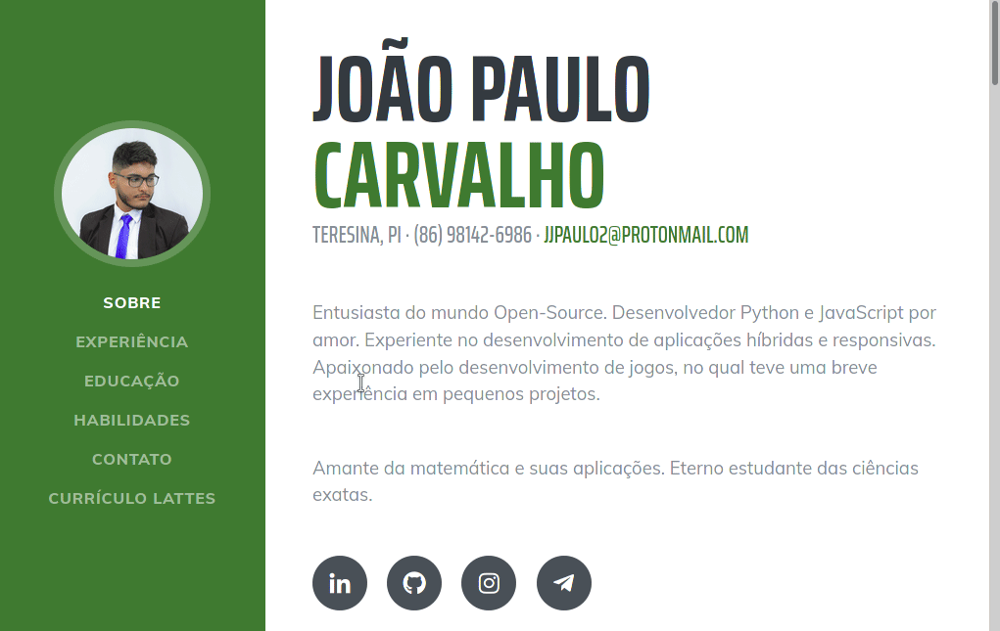

# My personal website `(legacy branch)`

## About this project

This is the first version from my personal website hosted at GitHub Pages. This is a statis page that was built only in pure HTML, CSS and Vanilla JS. It is the [Resume](https://startbootstrap.com/template-overviews/resume/) template from [Start Bootstrap](http://startbootstrap.com/).

> [Resume](https://startbootstrap.com/template-overviews/resume/) is a resume and CV theme for [Bootstrap](http://getbootstrap.com/) created by [Start Bootstrap](http://startbootstrap.com/). This theme features a fixed sidebar with content sections to build a simple, yet elegant resume.

### The contact form

The contact form is just a `iframe` to `https://formulario-contato.herokuapp.com/` that is already  a discontinued project. It was a contact form built in pure **PHP 7.1**, that sends emails to me usindo the `PHPMailer` library.

*Maybe the source code might be here one day?*
